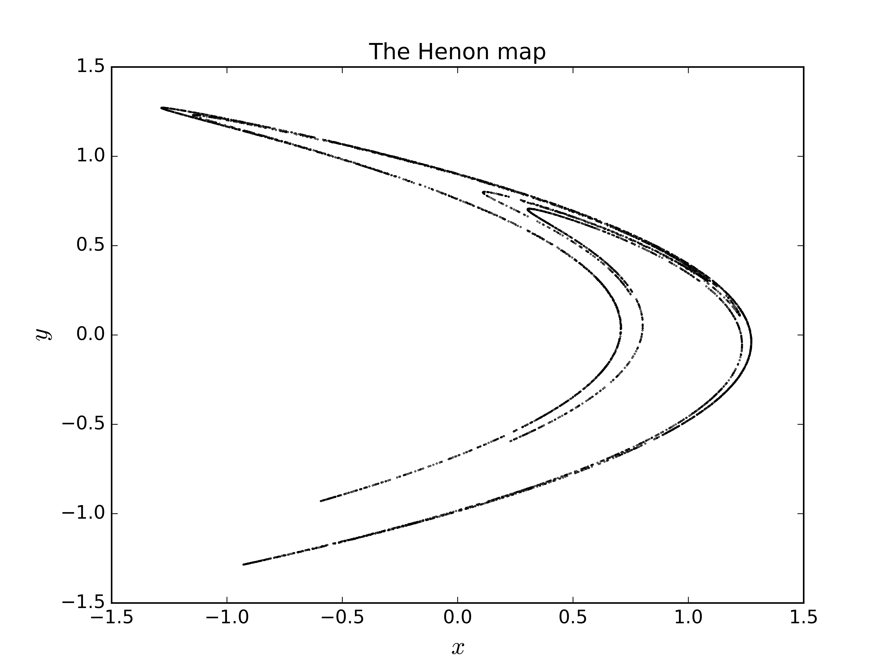
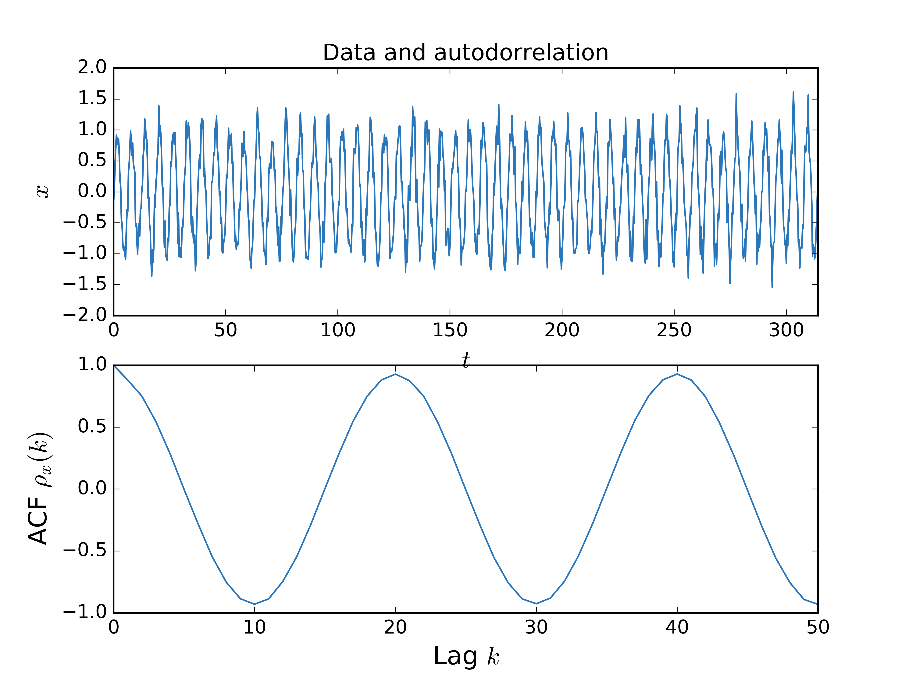

# pytisean

Python wrapper for calling functions supplied in the `TISEAN` package
<sup>[1](#myfootnote1)</sup>
for nonlinear time series analysis  (http://www.mpipks-dresden.mpg.de/~tisean/).

<a name="myfootnote1">[1]</a>: R. Hegger, H. Kantz, and T. Schreiber, *Practical implementation of nonlinear time series methods: The TISEAN package*, CHAOS 9, 413 (1999).
Preprint available:
[html](http://www.mpipks-dresden.mpg.de/~tisean/Tisean_3.0.1/index.html),
[other](http://www.mpipks-dresden.mpg.de/~tisean/Tisean_3.0.1/index.html).

<div class="alert alert-warning">
  <strong>`pytisean` Does not yet support `TISEAN` functions with multiple output files such as `d2`.</strong>
</div>

### Prerequisites
* `TISEAN` must be installed and in your path - the code is not included here
* This software has so far only been tested on OS X but  should be easy to port to Linux/Windows. Suggestions are welcome!

To use this package first import `pytisean`, `numpy` and `matplotlib`:

```python
from pytisean import tiseano, tiseanio
import matplotlib.pyplot as plt
import numpy as np
```

`pytisean` supplies two functions:
1. `tiseano` for TISEAN functions that do not need an input file,
2. `tiseanio` for functions that **do** need an input file.

Both return a result and the message that `TISEAN` prints to `stdout` or `stderr`. Examples:

```python
# Generate 5000 iterates of the henon map
henon, msg = tiseano('henon', '-l5000')

# Plot and prettyfi
fig1, ax1 = plt.subplots(1, 1)
ax1.scatter(henon[:, 0], henon[:, 1], color='k', s=0.1)
ax1.set_title('The Henon map')
ax1.set_xlabel(r'$x$', fontsize=16)
ax1.set_ylabel(r'$y$', fontsize=16)
plt.show()
```



```python
# Generate some data
N = 1000
t = np.linspace(0, N/10*np.pi, N)
x = np.sin(t) + 0.2*np.random.randn(N)
#  ... and compute the autocorrelation
acf, msg = tiseanio('corr', '-D', 50, data=x)

# Plot and prettyfi
bluish = '#2976bb' # https://xkcd.com/color/rgb/
fig2, ax2 = plt.subplots(2, 1)

ax2[0].set_title(r'Data and autodorrelation')
ax2[0].plot(t, x, color=bluish)
ax2[0].set_xlim(t[0], t[-1])
ax2[0].set_xlabel(r'$t$', fontsize=16)
ax2[0].set_ylabel(r'$x$', fontsize=16)

ax2[1].plot(acf[:, 0], acf[:, 1], color=bluish)
ax2[1].set_xlabel(r'Lag $k$', fontsize=16)
ax2[1].set_ylabel(r'ACF $\rho_x(k)$', fontsize=16)

plt.show()
```



## TODO
* Add support for multiple output files
* Add support for Windows and Linux
